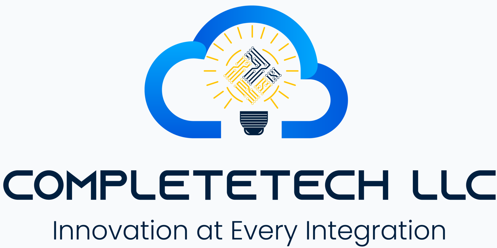
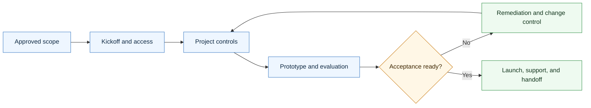

# Agentic Delivery Skill

<p align="center">
  
</p>

A CompleteTech LLC Codex skill for creating delivery execution artifacts after an agentic development proposal/SOW or contract is approved.

## About

Part of the CompleteTech LLC agentic services skill library. This skill supports approved-scope execution from kickoff through evaluation, launch, support, handoff, and closeout.

## OpenClaw / ClawHub Metadata

- Skill key: `agentic-delivery-skill`
- Version-ready metadata: `1.0.0`
- Homepage: https://github.com/CompleteTech-LLC/agentic-delivery-skill
- README: https://github.com/CompleteTech-LLC/agentic-delivery-skill#readme
- Runtime binaries: `python3`
- Python packages: none
- Intended registry/discovery tags: `latest`, `complete-tech`, `codex-skill`, `agentic-development`, `agentic-workflows`, `delivery`, `project-management`, `handoff`
- License: repository code, templates, and documentation use MIT; ClawHub publishing is intentionally skipped for now.
- Brand assets: CompleteTech LLC names, logos, seals, and brand assets are reserved; see `BRAND_ASSETS.md`.

## Workflow Diagram



## What It Does

- Selects the right delivery artifact by operational event.
- Drafts kickoff agendas, access checklists, project plans, milestone trackers, status updates, decision logs, risk/issue logs, change requests, prototype reviews, evaluation reports, acceptance packets, launch readiness checks, monitoring plans, support plans, handoff docs, runbooks, quickstarts, closeout summaries, and escalation procedures.
- Helps run the engagement cleanly and feeds verified delivery facts back into proposal, contract, invoice, email, discovery, and certificate workflows.
- Keeps delivery focused on practical, bounded agentic workflow implementation with human approval gates, evaluation evidence, logs, monitoring, documentation, support, and handoff.

## Contents

- `SKILL.md` - operating instructions and artifact-selection guide.
- `references/delivery-catalog.md` - reusable delivery/execution artifact templates.
- `references/use-case-decision-table.md` - quick guide for choosing the right artifact.
- `references/delivery-lifecycle.md` - flow from kickoff through support and closeout.
- `references/delivery-positioning.md` - CompleteTech LLC delivery language and guardrails.
- `scripts/render_delivery.py` - deterministic template listing and rendering helper.

## Quick Start

```bash
python3 scripts/render_delivery.py --list
python3 scripts/render_delivery.py \
  --template kickoff-agenda \
  --var client_name=Acme \
  --var workflow="support triage"
```

Rendered artifacts are drafts. Replace placeholders with verified client, scope, schedule, approval, risk, test, support, and handoff details before use.

## Brand Notes

Use a direct, concrete, low-hype tone. Present delivery as practical bounded implementation: execute the approved scope, protect human approval gates, track decisions and risks, verify evaluation examples, document logs and monitoring, prepare reviewers/admins, manage change requests, confirm acceptance, and hand off cleanly. Do not invent client facts, approvals, test results, metrics, regulated-use assurances, legal claims, or production readiness.

## License

Code, templates, and documentation are licensed under the MIT License. CompleteTech LLC names, logos, seals, and brand assets are reserved and are not licensed for reuse except to identify this project. See `LICENSE` and `BRAND_ASSETS.md`.
